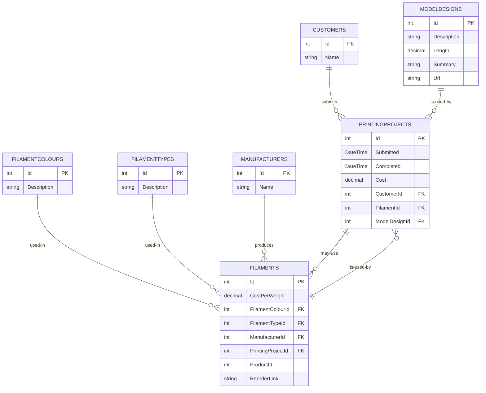

# 🧾 gCode Journal

An application to record the projects that I've 3D printed, along with the material used, the cost (both raw and 'sell' price), and links to the designs (if located on the internet) and/or photos of the finished product.

Apart from being functional, this is a project that I'm using to learn new technologies :man_student:.

## 🧰 Description

`gCode Journal` is a small learning project that demonstrates:

- A code-first data model using Entity Framework Core with SQLite as the persistence store. 🗄️
- A shared model library (`gCodeJournal.Model`) containing EF Core `DbContext` and entity types. 📚
- Migrations and data seeding for initial lookup values (manufacturers, filament types, colours). 🌱
- Multiple front-ends are possible (CLI, desktop, or web) that consume the shared model library. 💻

This repository focuses on the model and data layer; the GUI and web front-ends are intended to be added later.

---

## 🚀 Quick start (apply migrations & seed data)

- Install the EF tools if you don't have them:

```
# install dotnet-ef
dotnet tool install --global dotnet-ef
```

- Create and apply migrations (if you change the model):

```
# from solution root
# add migration
dotnet ef migrations add AddSomeChange --project src/gCodeJournal.Model --startup-project src/gCodeJournal.Model
# apply migration
dotnet ef database update --project src/gCodeJournal.Model --startup-project src/gCodeJournal.Model
```

- Programmatically apply migrations at app startup (recommended for apps):

```csharp
// Program.cs (example)
using Microsoft.EntityFrameworkCore;
using Microsoft.Extensions.DependencyInjection;
using Microsoft.Extensions.Hosting;

var host = Host.CreateDefaultBuilder(args)
    .ConfigureServices(services =>
    {
        services.AddDbContext<GCodeJournalDbContext>(options =>
            options.UseSqlite($"Data Source={GCodeJournalDbContext.GetDefaultDbPath()}"));
    })
    .Build();

using (var scope = host.Services.CreateScope())
{
    var db = scope.ServiceProvider.GetRequiredService<GCodeJournalDbContext>();
    // Applies all pending migrations including seed migrations
    db.Database.Migrate();
}

await host.RunAsync();
```

- Querying the context (example):

```csharp
using var context = new GCodeJournalDbContext();
var manufacturers = context.Manufacturers.ToList();
foreach (var m in manufacturers)
{
    Console.WriteLine(m.Name);
}
```

---

## 🗺️ Database schema (mermaid ER diagram)



Notes: the `FilamentColourFilamentType` join table implements a many-to-many relationship between colours and types.

---

## 🌱 Initial seeded data

The project includes migrations that seed a set of common manufacturers, filament types and colours. The intended initial seed values are listed below.

### 🏭 Manufacturers seeded

- Prusament
- Hatchbox
- eSUN
- MatterHackers
- ColorFabb
- Elegoo
- SUNLU
- Flashforge
- Slic3d

### 🧪 Filament types seeded

- PLA
- ABS
- PETG
- TPU
- Nylon
- ASA

### 🎨 Filament colours seeded

-  Black
-  White
-  Red
-  Dark Blue
-  Light Blue
-  Light Green
-  Sea Green
-  Yellow
-  Purple
-  Orange
-  Pink
-  Space Grey
-  Silver
-  Translucent
-  Brown
-  Wood
-  Marble


### Seed implementation notes

- Seeding can be implemented either via migration SQL (`migrationBuilder.Sql(...)`) or via `migrationBuilder.InsertData(...)` / `modelBuilder.HasData(...)` in `OnModelCreating`. Using `InsertData` / `HasData` is recommended for strongly-typed seeding and easier rollback via `Down`.
- Ensure migrations that seed data are created with `dotnet ef migrations add` so EF tracks and applies them.

---

## 📦 Referenced NuGet packages

| Package | Version (example) | License | Notes / Link |
|---|---:|---|---|
| `Microsoft.EntityFrameworkCore.Sqlite` | 9.0.9 | MIT (EF Core is under the .NET Foundation, MIT licensed) | https://www.nuget.org/packages/Microsoft.EntityFrameworkCore.Sqlite/ |
| `Microsoft.EntityFrameworkCore.Tools` | 9.0.9 | MIT (tooling for EF Core) | https://www.nuget.org/packages/Microsoft.EntityFrameworkCore.Tools/ |

### Notes on licenses

- EF Core packages are part of the .NET Foundation and are licensed under the MIT license. For the most up-to-date license text, consult the NuGet package page or the source repository.
- This table lists the packages referenced directly by the `gCodeJournal.Model` project. Transitive dependencies and platform-specific bundles may carry their own licenses; review the package pages for details.

---

## 🤝 Contributing

- Use `dotnet ef migrations add` to create new migrations and keep seed logic inside generated migration files or `OnModelCreating` data seeding.
- Run tests and build before creating PRs.

---

## 📚 Further reading

- EF Core Migrations: https://learn.microsoft.com/ef/core/managing-schemas/migrations/
- SQLite provider for EF Core: https://learn.microsoft.com/ef/core/providers/sqlite/
